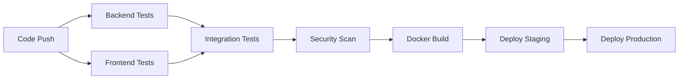

# TelematicsHQ Development Guide

## 🚀 CI/CD Pipeline Overview

TelematicsHQ uses GitHub Actions for automated testing, building, and deployment. The pipeline ensures code quality, runs comprehensive tests, and automates deployments.

### **Pipeline Structure**

```
📋 CI/CD Workflows
├── 🔧 backend-ci.yml       # .NET API testing and validation
├── 🎨 frontend-ci.yml      # Angular testing and build
├── 🚀 ci-cd.yml           # Comprehensive full-stack pipeline
└── 📦 deploy.yml          # Production deployment automation
```

## 🔧 Backend CI Pipeline

### **Triggers**
- Push to `main` or `develop` branches
- Pull requests targeting `main` or `develop`
- Changes to backend files (`TelematicsApi/**`, `TelematicsCore/**`, etc.)

### **Pipeline Steps**
1. **Environment Setup**
   - SQL Server 2022 container
   - .NET 8.0 SDK installation
   - Dependency restoration

2. **Build & Test**
   ```bash
   dotnet restore TelematicsDataPlatform.sln
   dotnet build --configuration Release
   dotnet test --verbosity normal
   ```

3. **API Validation**
   - Health endpoint testing
   - Metrics endpoint validation
   - Vehicles API functionality

4. **Results**
   - Test coverage reports
   - Build artifacts
   - API status validation

## 🎨 Frontend CI Pipeline

### **Triggers**
- Changes to `telematics-ui/**` files
- Angular-specific modifications

### **Pipeline Steps**
1. **Environment Setup**
   - Node.js 18.x installation
   - npm cache optimization
   - Dependency installation with `npm ci`

2. **Quality Checks**
   ```bash
   npm run lint           # ESLint validation
   npm run test:ci        # Unit tests with coverage
   npm run build          # Production build
   ```

3. **Outputs**
   - Frontend build artifacts (`dist/`)
   - Test coverage reports
   - Linting results

## 🚀 Full CI/CD Pipeline

### **Multi-Stage Pipeline**


### **Key Features**
- **Parallel Execution**: Backend and frontend tests run simultaneously
- **Integration Testing**: Full-stack API validation
- **Security Scanning**: Trivy vulnerability assessment
- **Docker Automation**: Multi-stage container builds
- **Environment Management**: Staging and production deployments

## 📦 Docker Integration

### **Multi-Stage Builds**

**Backend API:**
```dockerfile
FROM mcr.microsoft.com/dotnet/sdk:8.0 AS build
# Build and test
FROM mcr.microsoft.com/dotnet/aspnet:8.0 AS runtime
# Production runtime
```

**Frontend UI:**
```dockerfile
FROM node:18-alpine AS build
# Angular build
FROM nginx:alpine AS runtime
# Static file serving
```

### **Container Features**
- **Optimized Images**: Multi-stage builds for minimal size
- **Health Checks**: Built-in health monitoring
- **Environment Config**: Runtime configuration support
- **Security**: Non-root containers with minimal attack surface

## 🔄 Development Workflow

### **Local Development**
```bash
# Backend development
cd TelematicsApi
dotnet watch run --urls="http://localhost:5000"

# Frontend development
cd telematics-ui
npm start  # Runs on http://localhost:4201
```

### **Testing Workflow**
```bash
# Run all backend tests
dotnet test TelematicsTests/

# Run frontend tests
cd telematics-ui
npm run test:coverage

# Integration testing
docker-compose -f .github/docker-compose.ci.yml up
```

### **Pull Request Process**
1. **Create Feature Branch**
   ```bash
   git checkout -b feature/awesome-feature
   git commit -m "feat: add awesome feature"
   git push origin feature/awesome-feature
   ```

2. **Automated Checks**
   - Backend CI runs automatically
   - Frontend CI validates changes
   - Security scans execute
   - Code quality analysis

3. **Review & Merge**
   - Automated PR comments with build status
   - Required checks must pass
   - Code review and approval
   - Merge to `main` triggers deployment

## 🌐 Deployment Environments

### **Staging Environment**
- **Trigger**: Pushes to `develop` branch
- **Purpose**: Feature testing and validation
- **URL**: `https://staging.telematicshq.com`
- **Database**: Staging SQL Server instance

### **Production Environment**
- **Trigger**: Git tags (`v*`) or manual dispatch
- **Purpose**: Live application serving users
- **URL**: `https://telematicshq.com`
- **Database**: Production SQL Server with backups

### **Environment Configuration**
```yaml
# staging
API_URL: https://staging-api.telematicshq.com
DATABASE: Staging SQL Server
MONITORING: Basic health checks

# production  
API_URL: https://api.telematicshq.com
DATABASE: Production SQL Server with HA
MONITORING: Full observability stack
```

## 📊 Monitoring & Observability

### **Health Checks**
- **API Health**: `/api/health` endpoint monitoring
- **Frontend Health**: `/health` nginx endpoint
- **Database**: SQL Server connectivity validation

### **Metrics Collection**
- **System Metrics**: `/api/health/metrics` endpoint
- **Performance**: Response time monitoring
- **Error Tracking**: Exception logging with Serilog

### **Alerting**
- **Slack Integration**: Deployment notifications
- **GitHub Issues**: Automated failure reporting
- **Email Alerts**: Production incident notifications

## 🔧 Configuration Management

### **Environment Variables**
```bash
# Backend
ConnectionStrings__DefaultConnection=...
ASPNETCORE_ENVIRONMENT=Production
Serilog__MinimumLevel=Information

# Frontend
API_URL=https://api.telematicshq.com
ENVIRONMENT=production
```

### **Secrets Management**
- **GitHub Secrets**: CI/CD credentials
- **Azure Key Vault**: Production secrets
- **Docker Secrets**: Container-level security

## 🧪 Testing Strategy

### **Test Types**
```bash
# Unit Tests
dotnet test --filter Category=Unit

# Integration Tests  
dotnet test --filter Category=Integration

# Frontend Tests
npm run test:coverage

# E2E Tests
npm run e2e
```

### **Test Coverage Goals**
- **Backend**: >80% code coverage
- **Frontend**: >70% code coverage  
- **API Endpoints**: 100% health check coverage
- **Critical Paths**: 100% integration test coverage

## 🛠️ Development Tools

### **Required Tools**
- **.NET 8.0 SDK**: Backend development
- **Node.js 18+**: Frontend development
- **Docker**: Containerization and testing
- **Git**: Version control
- **VS Code**: Recommended IDE

### **Recommended Extensions**
- **C# Dev Kit**: .NET development
- **Angular Language Service**: Angular support
- **Docker**: Container management
- **GitLens**: Git enhancement
- **Thunder Client**: API testing

## 🚀 Performance Optimization

### **Backend Optimization**
- **Entity Framework**: Optimized queries
- **Caching**: In-memory and distributed caching
- **Connection Pooling**: SQL Server optimization
- **Logging**: Structured logging with Serilog

### **Frontend Optimization**
- **Lazy Loading**: Route-based code splitting
- **Tree Shaking**: Minimal bundle sizes
- **Compression**: Gzip and Brotli
- **CDN**: Static asset optimization

---

## 📚 Additional Resources

- **API Documentation**: `/api/swagger` endpoint
- **Component Storybook**: UI component library
- **Architecture Diagrams**: `docs/architecture/`
- **Troubleshooting Guide**: `docs/troubleshooting.md`

**TelematicsHQ Development Team** - *Building the Future of Fleet Management*